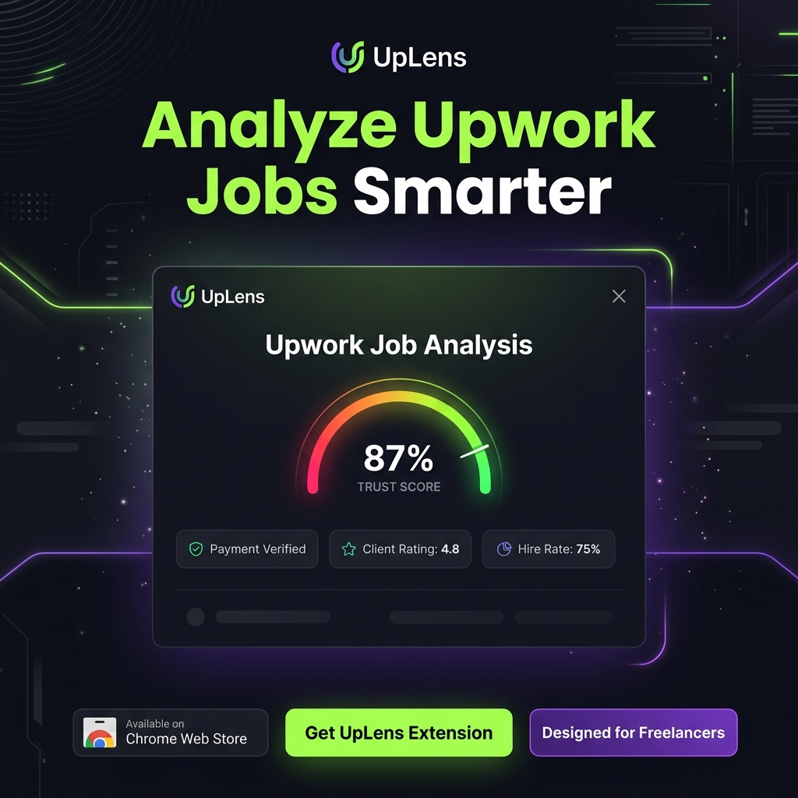

<div align="center">
  
  <h1>UpLens</h1>
  <p><strong>The Smart, AI-Powered Job Analyzer for Upwork Freelancers</strong></p>
  
</div>

UpLens is an open-source, privacy-first browser extension designed to protect freelancers from scams, bad clients, and low-budget traps on Upwork. It combines fast heuristic rule-matching with a powerful BYOK (Bring Your Own Key) AI engine to analyze job postings in milliseconds.

## 🚀 Features

* **Smart AI Analysis (BYOK):** Bring your own API key. UpLens automatically detects your provider (Gemini, Groq, OpenAI) and formats the request. Zero server costs, zero data collection.
* **Local LLM Support:** Use the "Custom URL" feature to route analysis to your local machines (e.g., LM Studio, Ollama) for 100% offline, free AI analysis.
* **Heuristic Red Flag Engine:** Instantly detects off-platform communication requests, unverified payment methods, and risky client histories via Regex—before you even trigger the AI.
* **Auto CV Parser & Skill Matcher:** Paste your CV text once! The AI automatically extracts your top technical skills, auto-saves them to your local storage, and dynamically matches them against every job you view with a visual progress bar.
* **Premium UI/UX:** Features a state-of-the-art UI with Apple Intelligence / Gemini style ambient glowing animations, a fully responsive layout, and a seamless Dark/Light mode toggle.
* **Manifest V3 & Vanilla JS:** Built with pure JavaScript and Tailwind CSS. No heavy frameworks (React/Vue), no external CDNs. Lightning-fast and RAM-friendly.
* **7+ Languages (i18n):** Fully localized interface and onboarding tour (English, Turkish, German, French, Spanish, Portuguese, Arabic).

## 🛠️ Installation (Developer Mode)
1. Clone the repository: `git clone https://github.com/AybarsOnurlu/Uplens.git`
2. Open Chrome/Edge and navigate to `chrome://extensions/`
3. Enable **Developer mode** in the top right corner.
4. Click **Load unpacked** and select the project directory.
5. Pin UpLens to your toolbar and complete the quick onboarding tour!

## 🧪 Testing

UpLens maintains a 100% test coverage using Jest and JSDOM. No real network requests are made during tests (fully mocked APIs).

```bash
npm install
npm run test
```

## 👨‍💻 Developed By

**Aybars** - Software Engineering Student & Open Source Enthusiast.

Feel free to contribute, open issues, or star the repository on GitHub! ⭐

👉 [**https://github.com/AybarsOnurlu/Uplens**](https://github.com/AybarsOnurlu/Uplens)
